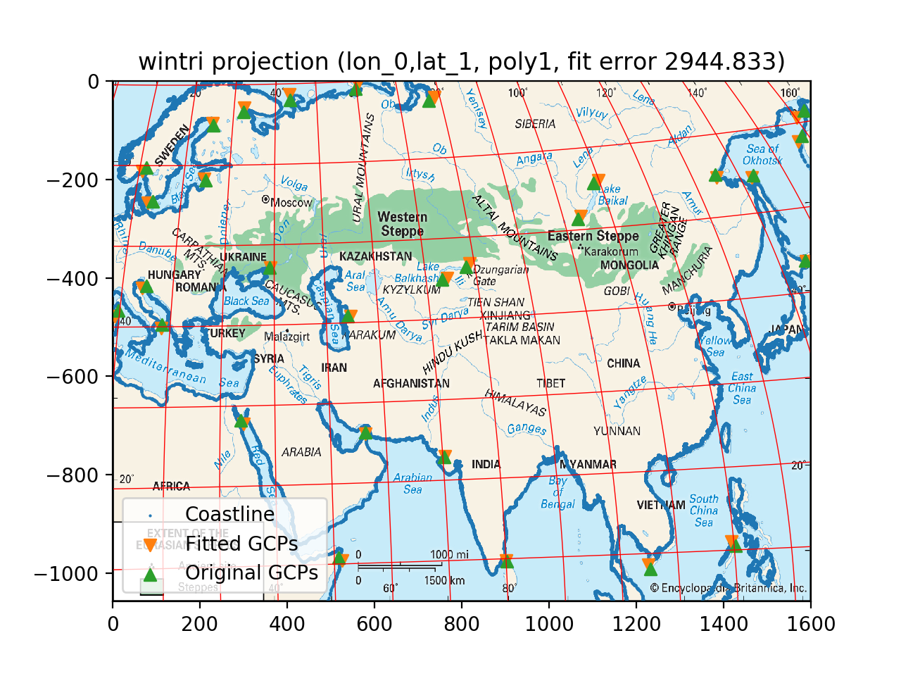

The Steppe, or How to fit arbitrary projections to data
=======================================================


Introduction
------------

In the current Encyclopedia Britannica's online article on ["Steppe, the"](https://www.britannica.com/place/the-Steppe), there is a fabulous map that I would love to see broken out of its static fetters and dance with different overlays (e.g., temperature, rainfall, etc.). Choosing to ignore copyright concerns for the sake of narrow educational pursuits, this project is specifically focused on determining the projection used by this map, in order to get as exact georeferencing as possible, i.e., to accurately convert the green pixels to longitude/latitudes.

Hence the subtitle of the project: how can one go from georeferenced control points (GCPs) to a projection's parameters?

Currently, the project leverages Pyproj and allows me to specify

- a projection (e.g., "aea" for the Albers equal-area),
- a list of its parameters (e.g., lon/lat of false origin, and two standard parallels), and
- an initial numeric guess for these parameters

and after running a nonlinear least squares (provided by Scipy), can plot the image with the original and best-fit GCPs, as well as a coastline via Natural Earth.

Installation
------------

Install Python3 (or consider using [pyenv](https://github.com/pyenv/pyenv) to easily manage different Python versions) and, in case you don't already have it, [Git](https://git-scm.com/). Then, in your command line, run the following (the `$` symbol indicates your command prompt and isn't meant to be typed):
```
$ pip install virtualenv
$ git clone https://github.com/fasiha/steppe-map.git
$ cd steppe-map
$ virtualenv .
$ source bin/activate
$ pip install -r requirements.txt --upgrade
```
This will ask pip, the Python package manager, to install virtualenv (`pip install virtualenv`), which lets us manage per-project dependencies without polluting our global Python install. Then, git makes a copy of this repository (`git …`) which you then enter (`cd …`) and set up a virtualenv to manage dependencies (`virtualenv …`). You then activate the virtualenv (`source …`), and install all dependencies in the local directory (`pip …`).

This repository includes a copy of the [Natural Earth Coastline database](http://www.naturalearthdata.com/downloads/10m-physical-vectors/10m-coastline/). Feel free to update it if you need to.

If you want to load the image and see the estimated projection's graticules on top of it, you'll need to download the 1600 by 1058 image from [Britannica's article on the Steppe](https://www.britannica.com/place/the-Steppe) and save it as `TheSteppe.jpg`. The MD5 checksum of the image I used to create the geo-control points is: `083cc490ff2ab9fb48d97af473362dd5  TheSteppe.jpg`.

Run
---
After creating a virtualenv and installing requirements in it, and gotten a copy of `TheSteppe.jpg`, make sure you're still in a virtualenv and run the code:
```
$ source bin/activate
$ python steppe.py
```
It takes less than a minute to run on my mid-2014 MacBook Pro. This should spit out some informative text and several plots.

Status
------

The parameter fitting aspect of the project is reasonably flexible in fitting any Pyproj-supported projection to be fit with as few or as many unknown parameters. The system also estimates an arbitrary 2D affine transform (scale, rotation, shear, shift, etc.).

After trying several dozen projections, I found that the Winkel Tripel projection gives the best accuracy in terms of error between control and fitted points. Below we show the 31 GCPs (included in this repo as `gcp.txt`), the graticules for the projection estimated from them, and the coastline.



This map's SRS:
```
+units=m +proj=wintri +lon_0=46.08057435794861 +lat_1=36.64778081811434
```

Note how despite putting several GCPs around the Mediterranean I couldn't beat back the distortion there.

We can boost the accuracy of the estimate using the ticks on the edges of the map (given in `ticks.points` in this repo). We use the above estimate to tweak the projection to matches these ticks. This reduces the worst-case error between lat/lon values from 4.5 degrees (above) to less than 1.1 degrees:


This map's SRS:
```
+units=m +proj=wintri +lon_0=43.13683225434687 +lat_1=39.869043318205726
```
But note how, while the graticules are better in the second image, there's worse distortion in the coastline.

The weird thing is, if I fit just a single-parameter Winkel Tripel (just `lon_0`), I get a different distribution of errors but the worst-case deviation is still around 1.1 degrees. 😡. So there's *something* weird going on with this map—either it's not Winkel Tripel, or it's hand-drawn, or it's doing some weird tangent projection.

Technical notes
---------------
§1. Note that most of these projections (see [http://www.remotesensing.org/geotiff/proj_list](http://www.remotesensing.org/geotiff/proj_list)) accept false easting and northing parameters, scalars which are added to all Cartesian locations. While the projection fitting can accommodate these readily, this is unnecessary as the we remove any affine (`a*x + b`) transform between the projection's output (in Cartesian space) and the GCPs' pixel locations using [Späth's algorithm (pdf)](http://hrcak.srce.hr/file/1425). In simpler terms, the projection fitting function will find and remove any rotation and translation that stands between the predicted pixel locations and the actual pixel locations --- treating such factors as unknowns to be estimated from data can possibly be detrimental to fit accuracy, and should not be done.

References
----------

The community at GIS.stackexchange has been very helpful --- see [http://gis.stackexchange.com/questions/43682/](http://gis.stackexchange.com/questions/43682/) --- thank you.
